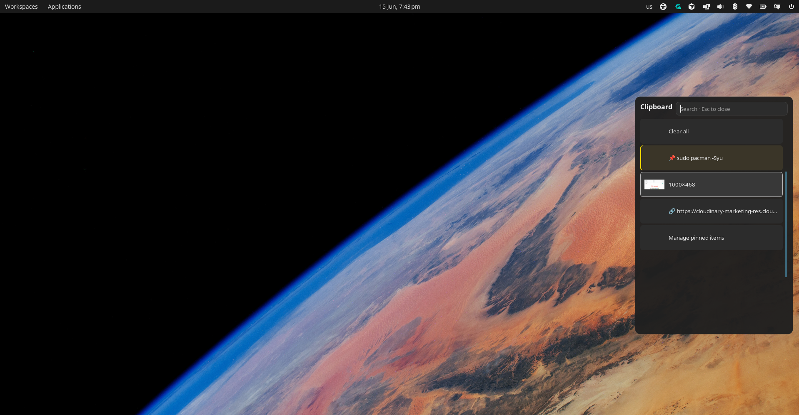

# cliphist-rofi

A clipboard history picker for Wayland. It uses [cliphist](https://github.com/sentriz/cliphist) to store copies, [rofi](https://github.com/davatorium/rofi) to show them, and `wl-copy` / `wtype` to paste back into whatever you were typing in.

The layout is modeled after the Windows 11 clipboard panel: pinned items up top, history below, search, small image thumbnails, and a compact dark theme.

Tested on COSMIC with rofi 2.0. Should work on other Wayland compositors that ship the same tools.




## What you get

- Pinned snippets from a plain text file
- Text and image history (screenshots show a small thumb)
- Search/filter in the rofi bar
- Select an entry and it copies + pastes into the focused field
- Clear all (with confirmation), delete one entry, pin from history
- Super+V toggle: press again to close if it is still open

## Requirements


| Package        | Purpose                                             |
| -------------- | --------------------------------------------------- |
| `cliphist`     | Store clipboard history                             |
| `rofi`         | Picker UI (2.0+; 2.1+ for click-outside on Wayland) |
| `wl-clipboard` | `wl-copy`, `wl-paste`                               |
| `wtype`        | Type text back into the focused window              |
| `imagemagick`  | Optional; nicer image thumbnails                    |


Arch/CachyOS example:

```bash
sudo pacman -S cliphist rofi wl-clipboard wtype imagemagick
```

## Install

```bash
git clone https://github.com/nishal21/cliphist-rofi.git
cd cliphist-rofi
./install.sh
```

Files land in `~/.config/cliphist/` and autostart entries go to `~/.config/autostart/`.

## Keybinding

Point your compositor shortcut at:

```
~/.config/cliphist/rofi-clipboard.sh
```

On COSMIC: Settings → Keyboard → Shortcuts → Custom → **Super+V** (or whatever you prefer).

Use the full path to your home directory. Linux paths are case-sensitive.

## Keyboard shortcuts


| Key             | Action                   |
| --------------- | ------------------------ |
| Enter           | Copy selection and paste |
| Esc             | Close                    |
| Super+V (again) | Close if already open    |
| Shift+Delete    | Delete selected entry    |
| Ctrl+Alt+P      | Pin selected entry       |
| Ctrl+Alt+M      | Edit pinned file         |
| Ctrl+Alt+C      | Clear all history        |


## Pinned items

Edit `~/.config/cliphist/pinned.txt`. One snippet per line, prefixed with `📌`:

```
📌 sudo pacman -Syu
📌 hello@example.com
```

Or pick **Manage pinned items** in the picker.

## COSMIC notes

Paste focus on COSMIC can be picky. The installer writes `~/.config/environment.d/90-cosmic-clipboard.conf` with `COSMIC_DATA_CONTROL_ENABLED=1`. Log out and back in after install.

On rofi 2.0, clicking outside the window may not close it (Wayland limitation). Use Esc or Super+V again. Rofi 2.1 adds proper click-outside support; the script already passes `-click-to-exit` for when you upgrade.

## Repo layout

```
cliphist-rofi/
├── bin/rofi-clipboard.sh    # Main launcher
├── theme/clipboard.rasi     # Rofi theme
├── config/
│   ├── config               # cliphist settings
│   └── pinned.txt.example
├── autostart/               # wl-paste watchers
├── install.sh
├── uninstall.sh
└── docs/cosmic.md           # Extra COSMIC setup notes
```

## Uninstall

```bash
./uninstall.sh
```

Removes installed files. Keeps `pinned.txt` and history cache unless you delete them yourself.

## License

MIT. See [LICENSE](LICENSE).